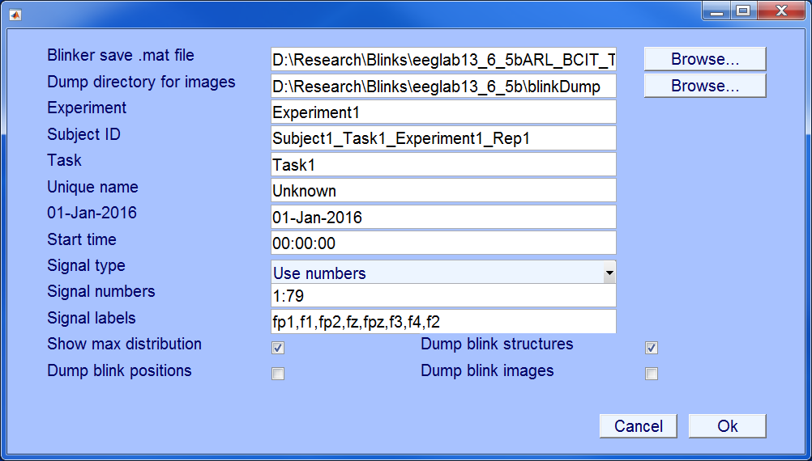
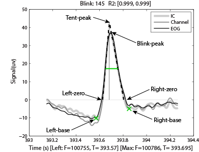
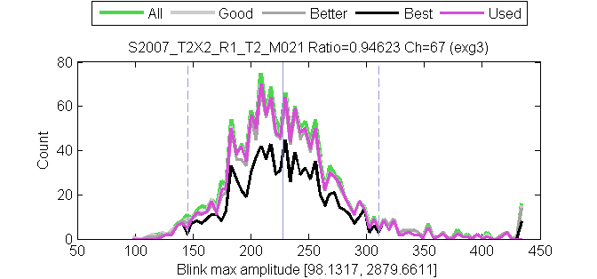

# Introduction to BLINKER
BLINKER and associated tools form an automated pipeline for detecting eye blinks in EEG and calculating various properties of these blinks. BLINKER takes as input an arbitrary number of signals, which can include ordinary EEG channels, EOG channels and independent components (IC), determines which signals have acceptable blinks, and then selects the "best" candidate blink signal to further characterize blink shapes and properties. BLINKER also has facilities for merging blinks calculated from different source signals and for plotting individual blinks to facilitate manual evaluation and synchronization of EEG with video and eye tracking. BLINKER is designed to be run in a completely automated way. 

The major sections of this document are:  

* <a name="Introduction">Introduction</a> 
  * [Requirements](#Requirements)  
  * [Citation](#Citing)   
  * [Installation](#Installing)  
* [Running BLINKER as an EEGLAB plugin](#Plugin)  
* [Running as a script](#Script)  
  * [Parameters describing data set metadata.](#Metadata)  
  * [Parameters describing what to save or display.](#Save)  
* The BLINKER algorithm  
  * [Extract potential blinks of each candidate signal.](#Extraction)  
  * [Calculate landmarks of potential blinks.](#Landmarks)  
  * [Reject signals with low signal-to-noise (SNR) ratios.](#SNR)  
  * [Select the "best" candidate signal as the "used" signal.](#Used)  
  * [Calculate the blink properties and blink shapes for the "used" signal.](#Shapes)  
  * [Calculate the ocular indices for the "used" signal.](#Stats)  
* Description of BLINKER structures  
  * [The blinks structure](#blinks)   
  * [The blinkFits structure](#blinkFits)  
  * [The blinkProperties structure](#blinkProperties)  
  * [The blinkStatistics structure](#blinkStatistics)  

### <a name="Requirements">Requirements</a>
The BLINKER pipeline relies on the MATLAB Signal Processing toolbox, the MATLAB Statistics toolbox and EEGLAB, a freely-available MATLAB toolbox for processing EEG. EEGLAB is available from  [http://scn.ucsd.edu/eeglab](http://scn.ucsd.edu/eeglab). Various high-level BLINKER wrapper functions assume that the EEG data is provided as an EEGLAB EEG structure and that channel locations are provided in the EEG.chanlocs structure. However, low-level processing functions work directly
on signals.

### <a name="Citing">Citing BLINKER</a>
BLINKER is freely available under the GNU General Public License. 
Please cite the following publication if using:  
> Kleifges K, Bigdely-Shamlo N, Kerick S, and Robbins KA  
> BLINKER: Large-scale automated analysis of ocular indices extracted from EEG  
>  

### <a name="Installation">Installation</a>
The BLINKER pipeline can be run in two ways --- as a standalone toolbox or as an EEGLAB plugin. To run in standalone mode, simply download the BLINKER code, found in the EEG-Blinks github repository, and add the `blinker` directory and all of its subdirectories to the MATLAB path. Regardless of how you run BLINKER, EEGLAB will need to be in your path.

## <a name="Plugin">BLINKER as an EEGLAB plugin</a>
You can install BLINKER as an EEGLAB plugin by unzipping the `blinker1.0.0` directory into the plugins directory of your EEGLAB installation. When you start EEGLAB, BLINKER will be available.

## Running the BLINKER pipeline from EEGLAB
Load an EEG dataset to be processed using the `Load dataset` submenu under the `File` menu of EEGLAB. The BLINKER pipeline 
can be found under the EEGLAB Tools submenu:  
  

After selecting the "Run Blinker" option, you will see a menu that allows you to set dataset metadata and options for saving BLINKER output. BLINKER is designed to be run without manual setting of internal algorithm parameters. However, these are all available for setting if you wish to run BLINKER from a script as described in the next section.

 

## <a name="Script">Running BLINKER as a script in batch processing mode</a>
While it is possible to run BLINKER as a plugin from EEGLAB, BLINKER is meant to be run in batch processing mode to analyze large collections of EEG. While it is possible to run BLINKER using the low-level functions, the easiest way to run BLINKER is to put your EEG dataset into an EEGLAB EEG structure.

**Example**  
Run BLINKER outside of EEGLAB but bring up a GUI to set parameters:

> `[EEG, com, blinks, blinkFits, blinkProperties, blinkStatistics, params] = pop_blinker(EEG);`  

**Example**  
Run BLINKER without manual intervention, using all of the default parameters:

> `[EEG, com, blinks, blinkFits, blinkProperties, blinkStatistics,  params] = pop_blinker(EEG, struct());  

**Example**  
The previous example uses all of the default values, including defaults for metadata such as the `subjectID`. Usually you will want to override the defaults. When you are going to override defaults it is good to start with a complete `params` structure with all of the default values filled in:  

> `params = checkBlinkerDefaults(struct(), getBlinkerDefaults(EEG));` 

**Example**  
The following example starts with a default `params` structure and then overrides some of the values related to controlling the output and to data set metadata:  

> `params = checkBlinkerDefaults(struct(), getBlinkerDefaults(EEG));`  
> `params.subjectID = 'S007';`  
> `params.experiment = 'ARL_BCIT';`  
> `params.uniqueName = 'S007_M053_Rep03';`  
> `params.task = 'RSVP';`  
> `params.fileName = 'D:\ARL_BCIT\S007_M053_Rep03.set';`  
> `params.startDate = '15-Feb-2009';`  
> `params.startTime = '15:26:31';`  
> `params.blinkerSaveFile = 'D:\ARL_BCIT_BLINKS\AllUnrefBlinkSummary.mat';`  
> `params.dumpBlinkerStructures = true;`  
> `params.dumpBlinkImages = false;`  
> `params.dumpBlinkPositions = false;`  
> `params.keepSignals = false;`  
> `params.showMaxDistribution = false;`  
> `params.verbose = false;`  
> `params.excludeLabels = {'a1', 'a2', 'vehicle position'};`  
> `[EEG, com, blinks, blinkFits, blinkProperties, blinkStatistics, params] = pop_blinker(EEG, params);`  

### <a name="Metadata">Parameters describing data set metadata</a>
The following parameters should be set individually for each data set so that the BLINKER output structures contain the information needed for downstream analysis.

**`excludeLabels`**  
The names of signals to exclude from consideration.  
[Row cell array of channel labels (default: {'exg5', 'exg6', 'exg7', 'exg8', 'vehicle position'}).]

**`experiment`**  
String identifying the experiment.  
[String (default is `'Experiment1'`).]

**`signalLabels`**  
The names of channels to try as potential signals if `signalTypeIndicator` is `'UseLabels'`.   
[Row cell array of channel labels (default: {'fp1', 'f1', 'fp2', 'fz', 'fpz', 'f3', 'f4', 'f2'}).]

**`signalNumbers`**  
The numbers of the channel numbers to try as potential signals if signalTypeIndicator is 'UseNumbers'.  
[Row vector of positive integers less than the number of channels (default 1:number of channels)]

**`signalTypeIndicator`**  
String specifying the type of signals from which to extract blinks. The possibilities are to use a specific set of channel numbers, a specific set of channels identified by their labels, or a specific set of independent components identified by their position in the mixing matrix.  
[String with possible values `'UseNumbers'` or `'UseLabels'` or `'UseICs'` (default is `'UseNumbers'`).]

**`srate`**  
A positive scalar giving the sampling rate of the signal in Hz. If an EEG structure is passed to `getBlinkerDefaults`, the default value is `EEG.srate`. Otherwise, the default 1.  
[Positive scalar (default is `EEG.srate` or 1 if EEG structure is not available).]

**`startDate`**  
String giving the start date of data set in dd-mmm-yyyy format.  
[String (default is `'01-Jan-2016'`).]

**`startTime`**  
String giving the start time in 24 hour hh:mm:ss format.    
[String (default is `'00:00:00'`).]

**`subjectID`**  
String identifying the subject for the data set. BLINKER uses this ID to combine short data sets from same session to get blink maxima distribution.   
[String (default is `'Subject1_Task1_Experiment1_Rep1'`).]

**`task`**  
Name of task performed in this data set.  
[String (default is 'Task1')]  
  
**`uniqueName`**  
String uniquely identifying this data set.    
[String (default is `'Unknown'`).]  

### <a name="Save">Parameters describing what to save or display</a>
The following parameters are usually set.

**`blinkerDumpDir`**  
The path of the directory in which to dump pictures of blinks. Usually this will be empty to start with.  
[char (default: [pwd filesep 'blinkDump'].)

**`blinkerSaveFile`**  
The full path name of the file to save the BLINKER structures and parameters in.  
[char (default: [pwd theNameOfDataset '_blinks.mat']).]

**`dumpBlinkImages`**  
Logical flag indicating whether to dump pictures of the individual blinks in a directory, indexed by an HTML file.  
[Logical (default:true).]

**`dumpBlinkPositions`**   
A logical flag indicating whether to dump a text file of the frame left zeros, and frames of blink maxima frames and times.  
[Logical (default:false).]

**`dumpBlinkerStructures`**  
Logical flag indicating whether to save all of the blinker structures in a file.  
[Logical (default: true)]

**`fileName`**  
The full path name of the input EEG file.  
[char]

**`numberMaxBins`**
Number of bins used to display histograms of blink maxima
[Scalar numeric positive (default: 80)]  

**`showMaxDistribution`**  
Logical flag indicating whether to show a figure with a histogram of blink maxima.  
[Logical (default: true)]

**`verbose`**  
A flag indicating whether to output status messages during execution and a summary of results at the end.  
[logical (default: true).] 

# BLINKER Algorithm Overview
This section discusses the algorithm and the setting of the various parameters.

### Processing steps
1. [Extract potential blinks of each candidate signal.](#Extraction)
1. [Calculate landmarks of potential blinks.](#Landmarks)
1. [Reject signals with low signal-to-noise (SNR) ratios.](#SNR)
1. [Select the "best" candidate signal as the "used" signal.](#Used)
1. [Calculate blink maximum amplitude distributions to eliminate eye movements.](#Maxima)
1. [Calculate the blink properties and blink shapes for the "used" signal.](#Shapes)
1. [Calculate the ocular indices for the "used" signal.](#Stats)

## <a name="Extraction">Extract potential blinks of each candidate signal</a>
Each candidate signal is band-passed filtered in the interval [1, 20] Hz prior to blink detection. BLINKER then determines the intervals during which the signal is greater than 1.5 standard deviations above the overall signal mean. These intervals form the potential blinks. We consider only potential blinks that are longer than 50 ms and are at least 50 ms apart. These criteria eliminate many small rapid eye movements without appearing to eliminate actual blinks.  

When using independent components, BLINKER performs an additional step to eliminate ICs that do not correspond to eye movements. These steps require that eyeCatch's evaluation of eye similarity be above `ICSimilarityThreshold` and that the frontal hemisphere scalp map weight for a component dominant the rear hemisphere.

Parameters related to this stage:  

**`lowCutoffHz`**  
The lower edge of the band pass filter applied to each candidate signal prior to detecting potential blinks. 
[Nonnegative scalar (default 1).]

**`highCutoffHz`**  
The upper edge of the band pass filter applied to each candidate signal prior to detecting potential blinks. 
[Nonnegative scalar (default 20).]

**`ICSimilarityThreshold`**  
Similarity threshold used by eyeCatch to designate an IC as a candidate blink IC.  
[Scalar value in [0, 1] (default: 0.85).]

**`ICFOMThreshold`**  
Mean difference in IC scalp map amplitude of front versus rear hemispheres (used to select blink ICs).  
[Scalar numeric positive (default: 1).

**`srate`**  
A positive scalar giving the sampling rate of the signal in Hz. If an EEG structure is passed to `getBlinkerDefaults`, the default value is `EEG.srate`. Otherwise, the default 1.  
[Positive scalar (default is `EEG.srate` or 1 if EEG structure is not available).]

**`stdThreshold`**    
Number of robust standard deviations above the mean the signal for potential blinks.  
[Scalar numeric positive (default is 1.5).]

## <a name="Landmarks">Calculate landmarks of potential blinks.</a> 

Having identified the potential blinks, BLINKER then applies a fitting process to find specified landmarks for each blink and saves information about the landmarks of candidate blink in a structure in the `blinkFits` structure described more completely in a [later section](#blinkFits). The following figure summarizes some important blink landmarks:

 

The `maxValue` the maximum value in the interval for this blink occurs at frame 100786 (the `maxFrame`), which is 393.695 seconds from the beginning of the data set. If two or more points in the interval achieve the maximum value, the `maxFrame` is the first. Other blink landmarks are computed as follows. 

The `leftZero` is the last zero crossing before `maxFrame`. If the signal does not cross zero between this blink and the previous blink, `leftZero` is the frame of the lowest amplitude between the blinks. The `rightZero` is the zero crossing after `maxFrame`. If the signal does not cross zero between this blink and the next blink, `rightZero` is the frame of the lowest amplitude between the blinks. The `upStroke` is the interval between `leftZero` and `maxFrame`, and the `downStroke is the interval between `maxFrame` and `rightZero`.  

The `leftBase` (frame 100755 at time 393.57 seconds in the example) is the first local minimum to the left of the maximum velocity frame in the `upStroke`. Similarly, the `rightBase` is the first local minimum to the right of the maximum velocity frame in the `downStroke`. BLINKER marks the leftBase and rightBase with green crosses when plotting blinks. 

BLINKER computes for each potential blink in a candidate signal the best linear fits for the inner 80% of the up-stroke and down-stroke, respectively. The quality (R2) of the correlation of these lines (denoted by `leftR2` and `rightR2`, respectively) with the actual blink trajectory is a measure of the closeness of the potential blink to a stereotypical blink. 

BLINKER computes the intersection of these fit two lines (the `yIntersect` at frame `xIntersect`) and displays the perpendicular line using a thin black line. This tent peak point is slightly forward of and above the maximum of the actual blink trajectory (the blink peak) in a stereotypical blink. The values left and right R2, as well as the relative position of the tent peak to the blink peak, provide simple tests of the how closely the blink resembles a stereotypical blink. 

## <a name="SNR">Reject signals with low signal-to-noise (SNR) ratios.</a>
After determining the landmarks for all of the potential blinks in a candidate signal, BLINKER computes the blink-amplitude ratio (BAR) for the signal. The blink-amplitude ratio is the average amplitude of the signal between the blink left-zero and right-zero zero crossings divided by the average amplitude of the positive portion of the signal “outside” the blink. (The blink excursion is always in the positive direction.) The left outer portion consists of the interval from the right-zero of the previous blink (or the beginning of the signal for the first blink) to the left-zero of this blink. The right outer portion consists of the interval from the right-zero of this blink to the left-zero of the next blink (or the end of the signal for the last blink). BLINKER rejects signals that have a BAR outside a specified range ([3, 50] by default). We have found empirically that signals with BAR values in the range [5, 20] usually capture blinks reasonably well. BAR is a measure of the signal-to-noise ratio (SNR) of the blink to the background in a candidate signal.

**Parameters:**  

**`blinkAmpRange`**  
The range of blink amplitude ratios allowed for candidate signals.   
[Two-element row vector of positive values (default: [3, 50]).] 

## <a name="Used">Select the "best" candidate signal as the "used" signal.</a>

The next step is to select the best candidate signal to be used for downstream calculations. The best signal is the one with `goodRatio` above `goodRatioThreshold` that has the maximum number of "good" blinks. A good blink for these purposes has both left and right correlations above `correlationThresholdBottom`. If no signals have a `goodRatio` above the threshold, then BLINKER picks the signal with highest number of good blinks and marks the signal as marginal by making the "used" value negative.  If `keepSignals` is true, then BLINKER retails all of the signals that meet the BAR criteria in the `signalData` structure. If `keepSignals` is false and some signals meet the `goodRatio` threshold, then BLINKER only retains those signals. In any case, BLINKER only retains signals that have at least `minNumberGoodBlinks` good blinks for downstream analysis.

To calculate the `goodRatio`, BLINKER computes the median and the robust standard deviation of the "best" blinks (those with both R2 values above `correlationThresholdTop`). The `goodRatio` is the ratio of the number of "good" blinks to the total number of blinks within two robust standard deviations of the median of the best blinks.

**`correlationThresholdBottom`**  
Minimum correlation of blink with linear fits in order to be considered a "good" blink.  
[Non negative scalar between 0 and 1 (Default: 0.90).]

**`correlationThresholdTop`**  
Minimum correlation of blink with linear fits in order to be considered a "best" blink.    
[Non negative scalar between 0 and 1 (Default: 0.98).]

**`goodRatioThreshold`**  
The minimum value of `goodRatio` needed for a signal to be considered non-marginal.
[Non negative scalar (default: 0.7).]

**`keepSignals`**
Flag indicating that BLINKER should retain all candidate signals that pass the blink amplitude ratio test regardless of their good ratios. This setting is useful when multiple datasets for the same session are to be combined downstream to determine the "best" signal.  
[Logical (default: false).] 

**`minGoodBlinks`**  
The minimum number of good blinks a signal must have to be considered a candidate signal.  
[Non negative scalar (default: 10).]

## <a name="Shapes">Calculate the blink properties and blink shapes for the "used" signal</a>
The `blinks` structure contains the positions of the potential blinks in the "used" signal. The next step is to eliminate extraneous eye movements from actual blinks and to calculate the shapes and other properties of these blinks. BLINKER uses the blink maximum amplitude distribution to do this. If a data set does not have a sufficient number of blinks (at least 20), BLINKER cannot get a good estimate of the distribution and the results are not reliable. Sometimes, however, reseachers have split a recording from a single session into multiple data sets for analysis. BLINKER provides tools for combining these pieces to obtain a more reliable estimate of the distribution. This section assumes that the data set has enough blinks for BLINKER to reliably estimate the maximum amplitude distribution.

The distribution of blink maximum amplitudes is typically bell-shaped, as show in the figure below.  
 

The green line shows the distribution of maximum amplitudes of all potential blinks, and the thick light gray line shows the distribution of maximum amplitudes of the “good” blinks (`upStroke` and `downStroke` R2 > 0.90). The medium thick gray line shows the distribution of maximum amplitudes of the “better” blinks (`upStroke` and `downStroke` R2 > 0.95), and the black line shows the distribution of maximum amplitudes of the “best” blinks (up-stroke and down-stroke R2 > 0.98). The magenta line shows the blinks selected by BLINKER.  These “used” blinks have up-stroke and down-stroke R2 > 0.90 and satisfy the maximum amplitude distribution criterion and the pAVR criterion.  These later criteria allow BLINKER to separate normal blinks from eye movements. 

The maximum amplitude distribution criterion enforces the bell-shaped maximum distribution that normal blinks have around the median of the “best” blinks. This criteria eliminates blinks whose R2 is low and whose amplitudes are far from the best blink median. By default, BLINKER eliminates “best blinks” more than five robust standard deviations from the median and “good” blinks more than two robust standard deviations away from this median. Here we define the robust standard deviation as 1.4826 times the median absolute deviation from the median. Fig. 3 displays the median of the “best” blinks with a gray vertical line and the locations that are two robust standard deviations from this median with dashed gray lines. 

To eliminate blinks that are outside the distribution, BLINKER applies a multi-stage z-score threshold method with cutoffs given in `zThresholds`. By default, "best" blinks must have amplitudes within 5 robust standard deviations of the "best" median, while other "good" blinks must have amplitudes withing 2 robust standard deviations of the "best" median.  

The pAVR criterion captures the difference the sharp rising edge of saccades and the more curved rise of normal blinks. We have found empirically that blink candidates with pAVR < 3 do not correspond to normal blinks, but rather saccades and certain short, fast eye movements. 

After eliminating potential blinks that do not meet these criteria, BLINKER calculates the shape information (`blinkFits`) and the properties (`blinkProperties`) of the actual blinks.

If `showMaxDistribution` is true, BLINKER displays the maximum amplitude distribution for the data set as in the example above.

**Parameters:** 

**`pAVRThreshold`**  
The minimum value of pAVR needed to be a blink rather than an eye movement.  
[Positive scalar (default: 3).]
 
**`correlationThresholdTop`**  
Minimum correlation of blink with linear fits in order to be considered a "best" blink.    
[Non negative scalar between 0 and 1 (Default: 0.98).]

**`correlationThresholdBottom`**  
Minimum correlation of blink with linear fits in order to be considered a "good" blink.  
[Non negative scalar between 0 and 1 (Default: 0.90).]

**`correlationThresholdMiddle`**   
Minimum correlation of blink with linear fits in order to be considered a "better" blink.  
[Non negative scalar between 0 and 1 (Default: 0.95).]

**`showMaxDistribution`**  
Logical flag indicating whether to show a figure with a histogram of blink maxima.  
[Logical (default: true)]

**`shutAmpFraction`**
Fraction of the maximum blink amplitude to reach above zero to consider the eye shut.  
[Scalar value in [0, 1] (default: 0.90).]

**`zThresholds`**  
Correlation and max z-score amplitude threshold pairs used for determining good blinks.  
[Non negative vector with 2 columns and at least two rows. (Default: [0.90, 2; 0.98, 5].)]

## <a name="Stats">Calculate the ocular indices for the "used" signal.</a>

BLINKER then uses `blinks`, `blinkFits`, and `blinkProperties` to compute overall blink statistics for the data set and stores the results in `blinkStatistics`.  If `verbose` is true, BLINKER outputs a summary of these statistics to the command window.

#BLINKER structures
BLINKER stores blink information in four major structures: [blinks](#blinks), [blinkFits](#blinkFits), [blinkProperties](#blinkProperties), and [blinkStatistics](#blinkStatistics). This section describes these structures in more detail.

## <a name="blinks">The blinks structure</a>
The `blinks` structure holds basic information about the dataset, the candidate signals and the positions of
the potential blinks in the candidate signals. 
**`experiment`**  
 String identifying the experiment or data collection that this dataset is part of.

**`fileName`**  
 String with the full path name of the file from which the blinks were computed.

**`signalData`**  
 Structure with details of the candidate signals and potential blink positions.

**`srate`**  
 Sampling rate in Hz of the signal.

**`startTime`**  
 Double value giving the days (to within) from January 0, 0000.

**`status`**  
 String indicated the status of the blink calculation. A value of "success" means that blinks were successfully computed, although the results may be marginal. A value of "failed" means that the algorithm could not extract blinks from any of the candidate signals provide.

**`subjectID`**  
 String identifying the subject from which the dataset was recorded. This field is used for display purposes and for combining datasets taken from a single subject in one session to improve estimates of blink maximum distribution.

**`task`**  
 String identifying the task performed by the subject for this dataset.

**`uniqueName`**  
 String uniquely identifying this dataset within the context of the analysis. Usually this will be a combination of the experiment, subject, task, replicate, and other identifying information. This string is used for display purposes and for lookup of datasets within a combined analysis.

**`usedSignal`**  
 Integer identifying the signal that is selected as the "best" signal for blinks. Usually this will be a channel number within the original dataset or the number of an IC within an independent component decomposition associated with the dataset. A negative value indicates that the results of the calculation were marginal and that the signal may not have captured the blinks reliability.

### <a name="signalData">The signalData substructure of blinks</a>
The `signalData` is a structure array containing information about candidate signals for the dataset. The individual fields are:

**`bestMedian`**  
A positive value giving the median blink maximum amplitude of the best candidate blinks. These blinks must have
left and right R^2 values at greater than `correlationThresholdTop` (0.98 by default).

**`bestRobustStd`**  
A positive number giving the 1.486 times the median absolute deviation from the median (mad) of the best candidate blinks. These blinks must have left and right R^2 values at greater than `correlationThresholdTop` (0.98 by default).

**`blinkAmpRatio`**  
A positive value indicating the blink-amplitude ratio for this signal.

**`blinkPositions`**  
A 2 x n array with the frame numbers of the starts and ends of intervals defining the portion of the n potential blinks that exceeds the threshold. The blink maximum should be in this interval.

**`cutoff`**  
A positive value estimating the boundary between the blink maximum distributions of the "good" blink candidates and the other blink candidates. If this value is well away from the `bestMedian`, the dataset is likely to have  good separation between blinks and eye movements.

**`goodRatio`**  
A positive numeric value between 0 and 1 indicating the fraction of blinks whose maximum amplitude is within two robust standard deviations of the median of the best blinks that are "good" blinks. This is a measure of how badly eye movements confound the maximum amplitude distribution.

**`numberBlinks`**  
The number of potential blinks detected in this signal.
[A nonnegative integer.]

**`numberGoodBlinks`**  
An integer giving the number of "good" potential blinks detected in this signal. These blinks must have
left and right R^2 values at greater than `correlationThresholdBottom` (0.90 by default).
[A nonnegative integer.]

**`signal`**  
The timeseries for this signal.

**`signalLabel`**  
A unique identifier of the signal within the dataset as a whole (for example the channel label). BLINKER automatically creates labels for independent components: 'IC1', 'IC2', etc.
[A string.]

**`signalNumber`**  
A unique integer identifier of the signal within the dataset as a whole (for example the channel number of the IC number.)
[A positive integer.]

**`signalType`**  
 String indicating the type of signal this is. Usually the `signalType` will indicate how the initial candidate signals were specified and will have a value 'SignalNumbers', 'SignalLabels', `ICs'. 

## <a name="blinkFits">The blinkFits structure</a>
The `blinkFits` structure array holds basic shape information for a set of potential blinks. In `extractBlinkProperties` function returns this structure for the potential blinks of the used signal that meet specific quality criteria. Values that are undefined, have value `NaN`. The fields are:

**`number`**  
The number of the potential blink within the corresponding blinks structure.
[A positive numeric value.]

**`maxFrame`**  
The frame number of the first maximum amplitude of this blink.
[A positive numeric value.]

**`maxValue`**  
A numeric value giving the maximum value of the blink.

**`leftOuter`**  
The frame number of the left outer reach of the blink (defined as the largest of 1 or the frame of the previous blink maximum).  
[A positive numeric value.]

**`rightOuter`**  
The frame number of the right outer reach of the blink (defined as the smallest of the last frame or the frame of the next blink maximum).  
[A positive numeric value.]

**`leftZero`**  
The frame number of the left zero crossing of the blink.
[A positive numeric value.]

**`rightZero`**  
The frame number of the right zero crossing of the blink.
[A positive numeric value.]

**`leftBase`**  
The frame number of the left local minimum of the blink.
[A positive numeric value.]

**`rightBase`**  
The frame number of the right local minimum of the blink.
[A positive numeric value.]

**`leftBaseHalfHeight`**  
The coordinate of the signal halfway (in height) between the blink maximum and the left base value.
[A positive numeric value.]

**`rightBaseHalfHeight`**  
The coordinate of the signal halfway (in height) between the blink maximum and the right base value.  
[A positive numeric value.]

**`leftZeroHalfHeight`**  
The coordinate of the signal halfway (in height) between the blink maximum and the left zero value.  

**`rightZeroHalfHeight`**  
The coordinate of the signal halfway (in height) between the blink maximum and the right zero value.  

**`leftRange`**  
A two-element row vector indication the interval in frames between 10% above the `leftBase` and 10% below the blink maximum.

**`rightRange`**  
A two-element row vector indication the interval in frames between 10% below the blink maximum and 10% above the `rightBase`.

**`leftSlope`**  
The slope of the left tent line or NaN if the tent line doesn't exist.

**`rightSlope`**  
Slope of the right blink tent line or NaN if the tent line doesn't exist.

**`averLeftVelocity`**  
The velocity as estimated by the left tent line.

**`averRightVelocity`**  
The velocity as estimated by the right tent line.

**`leftR2`**  
The correlation of the left tent line with the 80% blink upstroke. 
[A numeric value or NaN if the tent line doesn't exist.]

**`rightR2`**  
The correlation of the right tent line with the 80% blink downstroke. 
[A numeric value or NaN if the tent line doesn't exist.]

**`xIntersect`**  
The x-coordinate of the intersection of the left and right tent line with the x-axis.  
[A numeric value or NaN if the tent line doesn't exist.]

**`yIntersect`**  
The y-coordinate of the intersection of the left and right tent line with the x-axis.  
[A numeric value or NaN if the tent line doesn't exist.]

**`leftXIntercept`**  
An integer giving the frame number of the intersection of the left tent line with the x-axis (or NaN if the tent line doesn't exist).

**`rightXIntercept`**   
An integer giving the frame number of the intersection of the right tent line with the x-axis (or NaN if the tent line doesn't exist).

## <a name="blinkProperties">The blinkProperties structure</a>
The `blinkProperties` structure array holds basic ocular characteristics for a set of potential blinks. The `extractBlinkProperties` function returns this structure for the potential blinks of the used signal that meet specific quality criteria. Values that are undefined, have value `NaN`. The fields are:

**`durationBase`**  
Length of the blink in seconds calculated as the difference between `rightBase` and `leftBase`.

**`durationZero`**  
Length of the blink in seconds calculated as the difference between `rightZero` and `leftZero`.  

**`durationTent`**  
Length of the blink in seconds calculated as the difference between `rightZero` and `leftZero`.  

**`durationHalfBase`**  
Length of the blink in seconds calculated as the difference between the frame marking the left half base amplitude and the first intersection of the horizontal line drawn from the blink value at that point to the down stroke of the blink.

**`durationHalfZero`**  
Length of the blink in seconds calculated as the difference between the frame marking the left half zero amplitude and the first intersection of the horizontal line drawn from the blink value at that point to the down stroke of the blink.

**`interBlinkMaxAmp`**  
Length of the interval in seconds between successive blink peaks.

**`interBlinkMaxVelBase`**  
Length of the interval in seconds between the maximum positive velocity (calculated from `leftBase`) of one blink and the next one. 

**`interBlinkMaxVelZero`**  
Length of the interval in seconds between the maximum positive velocity (calculated from `leftZero`) of one blink and the next one. 

**`negAmpVelRatioBase`**  
The amplitude velocity ratio calculated using interval from `maxBlink` to `rightBase`.  

**`posAmpVelRatioBase`**  
The amplitude velocity ratio calculated using interval from `leftBase` to `maxBlink`.  

**`negAmpVelRatioZero`**  
The amplitude velocity ratio calculated using interval from `maxBlink` to `rightZero`.  

**`posAmpVelRatioZero`**  
The amplitude velocity ratio calculated using interval from `leftZero` to `maxBlink`.   

**`negAmpVelRatioTent`**  
The amplitude velocity ratio calculated using the tent-peak and the slope of the right tent line.   

**`posAmpVelRatioTent`**  
The amplitude velocity ratio calculated using the tent-peak and the slope of the left tent line.   

**`'timeShutBase`**   
Time in seconds that the blink is at least 90% of its amplitude from the `leftBase`.
**`'timeShutZero`**  
Time in seconds that the blink is at least 90% of its amplitude from the `leftZero`.

**`timeShutTent`**  
TIme in seconds that the blink is at least 90% of the tent peak height.

**`closingTimeZero`**  
Time in seconds between the `leftZero` frame and the `maxFrame`.

**`reopeningTimeZero`**  
Time in seconds between the `maxFrame` and the `rightZero` frame.

**`closingTimeTent`**  
Time in seconds between the `LeftXIntercept` and the `xIntersect` frames that define the tent.

**`reopeningTimeTent`**  
Time in seconds between the `xIntersect` and the `RightXIntercept` frames that define the tent.

**`peakTimeBlink`**  
Time in seconds from the start of the file of the maximum of the blink.

**`peakTimeTent`**  
Time in seconds from the start of the file of the peak of the tent.

**`peakMaxBlink`**  
Maximum amplitude of the blink.

**`peakMaxTent`**  
Maximum height of the tent peak.

## <a name="blinkStatistics">The blinkStatistics structure</a>
The `blinkProperties` structure array holds basic ocular characteristics for a set of potential blinks. The `extractBlinkProperties` function returns this structure for the potential blinks of the used signal that meet specific quality criteria. Each of the ocular indices labeled "statistics" is characterized by an 8-element vector giving the data set mean, median, standard deviation and median absolute deviation for all blinks followed by the statistics for "good" blinks. The exception to this is the number of `blinksPerMinute`.

**`blinksPerMin`**  
Statistics for the number of blinks per minute for the dataset. Note: this entry has a special form for the 8-element statistics vector. The first entry of the vector contains the total number of blinks per minute, and the fifth entry contains the total number of good blinks per minute.

**`durationB`**  
Length of the blinks in seconds as calculated by (`rightBase` - `leftBase`)/`srate`.

**`durationHB`**  
Statistics for the blink durations calculated by the width of the blink at an amplitude half way between the `leftBase` and the `maxFrame`.

**`durationHZ`**  
Statistics for the blink durations calculated in seconds based on the widths of the blinks at half of the maximum amplitude.

**`durationT`**  
Statistics for the blink duration calculated in seconds based on the widths of the intersection of the blink tent with the x-axis.

**`durationZ`**  
Staistics for the blink duration calculated in seconds based on the difference (`rightZero` - `leftZero`)/`srate`.

**`fileName`**  
The filename of the data set for which these statistics were calculated.

**`goodRatio`**  
The `goodRatio` for this data set.

**`header`**  
A cell array describing the meanings of the columns in the statistics vectors.

**`numberBlinks`**  
The total number of blinks in the data set.

**`numberGoodBlinks`**  
Total number of good blinks in the data set.

**`nAVRZ`**  
Statistics for the negative amplitude velocity ratio calculated from the `maxFrame` to the `rightZero` of each blink.

**`pAVRZ`**  
Statistics for the positive amplitude velocity ratio calculated from the `leftZero` to `maxFrame` of each blink.

**`seconds`**  
The length of the data set in seconds.

**`srate`**  
Sampling rate in Hz of the signal.

**`startTime`**  
Double value giving the days from January 0, 0000.
 
**`status`**  
String indicated the status of the blink calculation. A value of "success" means that blinks were successfully computed, although the results may be marginal. A value of "failed" means that the algorithm could not extract blinks from any of the candidate signals provide.
 
**`subjectID`**  
String identifying the subject from which the dataset was recorded. This field is used for display purposes and for combining datasets taken from a single subject in one session to improve estimates of blink maximum distribution.

**`task`**  
String identifying the task performed by the subject for this dataset.
 
**`uniqueName`**   
String uniquely identifying this data set.
           
**`usedLabel`**  
The `signalLabel` of the "best" signal.

**`usedNumber`**  
The `signalNumber` of the "best" signal.
